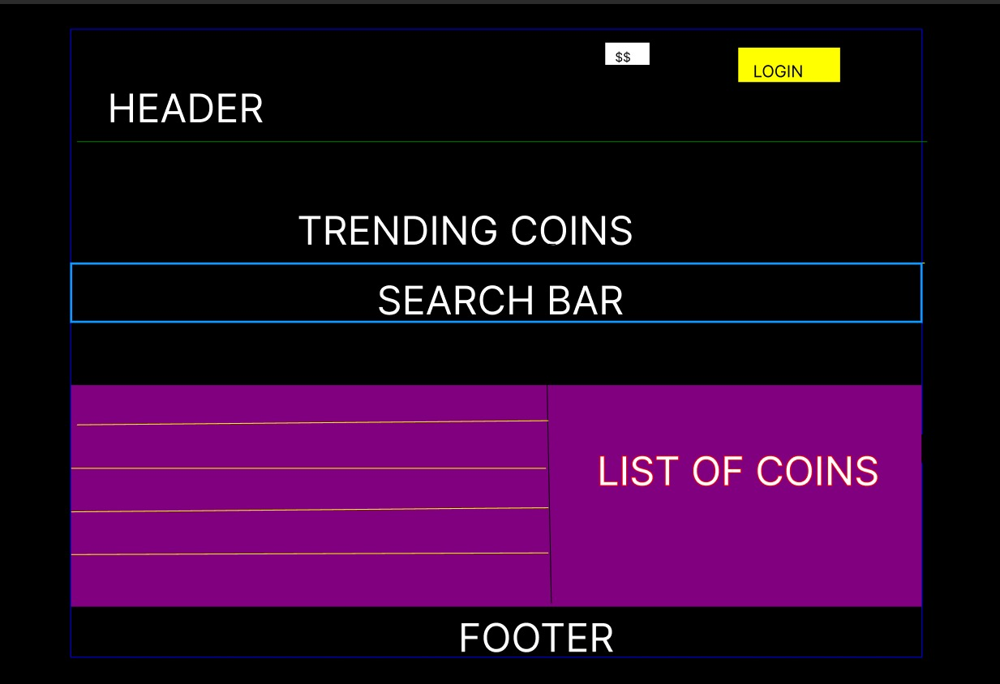

<!-- PROJECT Header -->
 

  <h2 align="center">CRYPTO-TRACKING-APP
</h3>

  

    Get All The Latest Info Regarding Your Favorite Crypto Currency And Crypto News Update!
     
    <!-- <a href="https://github.com/othneildrew/Best-README-Template">View Demo</a> -->

<!-- TABLE OF CONTENTS -->

  
Table of Contents

  <ol>
    <li>
      <a href="#about-the-project">About The Project</a>
      <ul>
        <li><a href="#built-with">Built With</a></li>
        <li><a href="#wireframe">Wireframe</a></li>
      </ul>
    </li>
    <li>
      <a href="#getting-started">Getting Started</a>
      <ul>
        <li><a href="#prerequisites">Prerequisites</a></li>
        <li><a href="#installation">Installation</a></li>
      </ul>
    </li>
    <li><a href="#usage">Usage</a></li>
     <li><a href="#contributing">Contributing</a></li>
    <li><a href="#roadmap">Roadmap</a></li>
    <li><a href="#contact">Contact</a></li>
  </ol>

<!-- ABOUT THE PROJECT -->
## About The Project

This app is build with the existing knowledge of the React basics, and give you further practice working with React context,Chart Js, Firebase,MUI, codebase linting, component testing,Git-Flow workflow , and TypeScript.
 A user should, at the bare minimum, be able to view all the Top 100 list of Cryptocurrencys based on their market capital , Shows the trending coins over the last 24 hour,Search for a particular coin from the list and Shows a Historical chart of a specfic coin with a detail information on a daily ,monthly and year base and additionaly a user can learn and read on the latest update on the News section.
For a specfic user with login  credential the user can add a coin to his the watch list and remove the coin from the watch list when ever he wantes.

(<a href="#readme-top">back to top</a>)

### Built With

A few of the frameworks/libraries that were used to build the project are:

* React
* Context ApI
* Chart Js
* Typescript
* MUI
* Firebase/Google authentication
* Axios
* React Router
* React testing Libraries 
* EsLint AirBnb and Prettierr

(<a href="#readme-top">back to top</a>)

### wireframe
  ### Getting Started The App build out with simple wireframes using Figma.

## Getting Started

To install CRYPTO-TRACKING-APP, follow these steps:
### Prerequisites

* npm
  sh
  npm install npm@latest -g
  

### Installation

Below is an example of how you can instruct your audience on installing and setting up your app. This template doesn't rely on any external dependencies or services.

1. Clone the repo
   sh
   git clone https://github.com/Ermiass/crypto-tracking-app
   
3. Install NPM packages
   sh
   npm install
   
4. Get a free  API key from Firebase By Siging up and Enter your Firebase API_KEY link in your `.env` file 
   js
   REACT_APP_FIREBASE_API_KEY = 'ENTER YOUR API_KEY';
   
5. npm start 
  sh
   npm start 
   

(<a href="#readme-top">back to top</a>)

<!-- USAGE EXAMPLES -->
## Usage

Can be used to track the price of  top cryptocurencys, historical chart  and detail information on coin,get the latest news on cryptocurencys,cryptomarketes,NFTs and usfull teaching vidos.

- [x] Display List of TOP 100 Coins
- [x] Display List of trending coins over the last 24 hour
  [x] User Can Change the Currency Type Of Any Coin
    - [x] USD
    - [x] EUR
- [x] Able To Search For  particular coin 
- [x] Shows a detail Information on a Particular Coin
- [x] Shows a Historical chart of a coin
- [x] News Update on crpocurencies and NFT 
- [x] IF User Logged In/Sign Up
    - [x] Able to add coins to User watchlist 
    - [x] Remove coins from User watchlist 

(<a href="#readme-top">back to top</a>)

<!-- CONTRIBUTING -->
## Contributing
If you have a suggestion that would make this better, please fork the repo and create a pull request. You can also simply open an issue with the tag "enhancement".
Don't forget to give the project a star! Thanks again!

1. Fork the Project
2. Create your Feature Branch (`git checkout -b feature/AmazingFeature`)
3. Commit your Changes (`git commit -m 'Add some AmazingFeature'`)
4. Push to the Branch (`git push origin feature/AmazingFeature`)
5. Open a Pull Request

(<a href="#readme-top">back to top</a>)

<!-- CONTACT -->
## Contact

Ermias Mahtemu - emahtemu@alphaworks.tech

Project Link: [https://github.com/Ermiass/crypto-tracking-app](https://github.com/Ermiass/crypto-tracking-app)

(<a href="#readme-top">back to top</a>)
